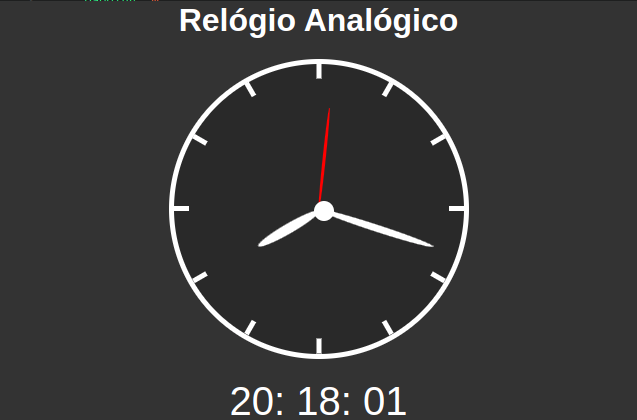

<h1 align="center"> JS Clock </h1>



Link da demo: https://jsfiddle.net/tayse_rosa/3ywv1sm8/2/

---

## ➡️ About
<b>Portugues:</b>
O projeto foi desenvolvido com a intenção de ser uma **base de conhecimento** para consultas de iniciantes na área de **Javascript**, tanto para minhas futuras consultas rápidas, como para outros desenvolvedores JS que por ventura esqueceram como se faz alguma funcionalidade.
Neste projeto podemos ver como funciona o setInterval, bem como posicionamento de ponteiro, funçõe e querySelector.

<b>English:</b>
The project was developed with the intention of being a **knowledge base** for beginners' queries in the **Javascript** area, both for my future quick queries, as well as for other JS developers who have perhaps forgotten how to do something functionality. In this project we can see how setInterval works, as well as pointer positioning, function and querySelector.

---

## 🚀 Technologies used
<b>Portugues:</b>
O projeto foi desenvolvido utilizando as seguintes tecnologias:

<b>English:</b>
The project was developed using the following technologies.

- HTML5
- CSS3
- Javascript

---

## 📥 How to use
```js

    //Clone the repository
    $ git clone https://github.com/TayseRosa/jsClock.git

    //Enter the directory 
    $ cd jsClock

    //Start the project
    Double click em index.html for open the project.

``` 

---
<h4 align="center"> Developed by 🚀 Tayse Rosa 🌸 </h4>
